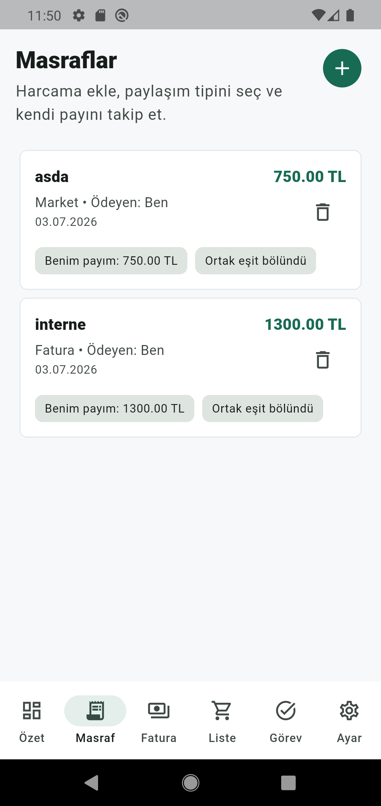

# Ev Masraflari App

Local-first Flutter uygulamasi. Ev masraflarini, faturalarini, alisveris listesini ve ev gorevlerini tek yerde takip etmek icin gelistirildi.



## Ozellikler

- Dashboard uzerinden aylik ev gideri ozeti
- Kisi ve ev arkadasi kaydi
- Sadece bana ait veya ortak esit bolunen masraf girisi
- Fatura turu ve aylik fatura takibi
- Odenen faturadan otomatik masraf kaydi olusturma
- Biten aylar icin arsiv ve detayli ay raporu
- Alisveris listesi: ekleme, filtreleme, satin alindi isaretleme, silme
- Ev gorevleri: normal gorev ve rutin gorev akislari
- JSON yedek alma ve geri yukleme
- Internet gerektirmeyen local-first veri saklama

## Teknoloji

- Flutter / Dart
- Material UI
- Hive + hive_flutter
- Repository pattern
- Widget ve unit testleri

## Kurulum

```bash
flutter pub get
flutter run
```

Android APK uretmek icin:

```bash
flutter build apk --release
```

Olusan APK genelde su dizindedir:

```text
build/app/outputs/flutter-apk/app-release.apk
```

GitHub icin APK'yi repo icine build klasorunden commit etmek yerine Releases bolumune asset olarak eklemek daha temizdir. Repo icinde tutulacaksa `releases/` klasoru kullanilabilir.

## Test ve Kontrol

```bash
dart format lib test
flutter analyze
flutter test
```

Mevcut test paketi masraf, fatura, dashboard, backup/restore, alisveris listesi ve gorev akislarini kapsar.

## Veri ve Gizlilik

Uygulama ilk surumde backend kullanmaz. Veriler cihazda Hive ile local olarak tutulur. JSON yedek dosyalari kullanici tarafindan disari aktarilir ve tekrar ice aktarilabilir.

Public repo icin keystore, environment dosyalari, Firebase/Google servis dosyalari ve local yedek ciktilari `.gitignore` ile disarida birakilmistir.

## Dokumanlar

Detayli teknik notlar `docs/` klasorundedir:

- [Proje Ozeti](docs/01_PROJECT_OVERVIEW.md)
- [Local-first Mimari](docs/02_LOCAL_FIRST_ARCHITECTURE.md)
- [Veri Modelleri ve Storage](docs/03_DATA_MODELS_AND_STORAGE.md)
- [Ozellik Detaylari](docs/04_FEATURE_SPECIFICATIONS.md)
- [Backup / Restore](docs/05_BACKUP_RESTORE_AND_MIGRATION.md)
- [Roadmap](docs/06_DEVELOPMENT_ROADMAP.md)
- [Gelecek Backend / Firebase Plani](docs/07_FUTURE_BACKEND_FIREBASE_PLAN.md)

## Lisans

Bu repo icin lisans henuz eklenmedi. Public kullanima acmadan once tercih edilen lisans dosyasi eklenmelidir.
